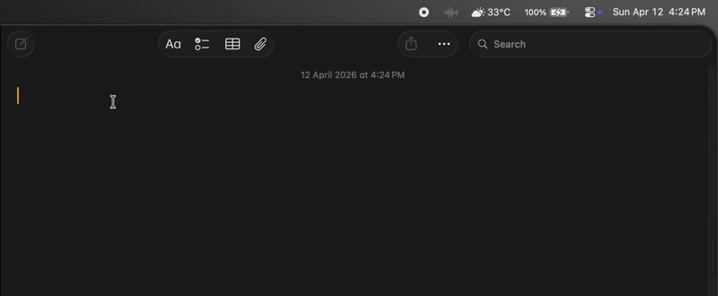

# OpenFlow

> Open-source Wispr Flow clone for macOS — hold a key, speak, watch your words appear.

**Private · Fast · Free · Open Source**



[](LICENSE)
[](https://github.com/vishnuhari17/OpenFlow/actions)
[](https://github.com/vishnuhari17/OpenFlow/releases)

---

## How it works

1. Hold your hotkey (default: Right ⌘)
2. Speak
3. Release — your words appear instantly in whatever you're typing

OpenFlow reads the surrounding screen text via macOS Accessibility APIs to give Whisper contextual hints, then pastes a draft immediately while an LLM silently cleans up filler words in the background. Total latency from release to final text: **~500ms**.

```
Hold key → audio capture
               │
               ├─ screen context (AX APIs) ──→ Whisper prompt bias
               │
               └─→ Whisper transcription → draft paste
                                                │
                                      LLM refinement (background)
                                                │
                                         replace draft in-place
```

**Progressive paste**: the raw transcription lands immediately. The LLM refinement runs in the background and silently replaces the text if it changed anything. You never wait.

---

## Why OpenFlow vs Wispr Flow

| | Wispr Flow | OpenFlow |
|---|---|---|
| Price | $20/month | Free |
| Open source | No | Yes |
| Telemetry | Unknown | None |
| Custom LLM / model | No | Yes |
| Local model support | No | Planned |
| Latency | ~800ms | ~500ms |
| API key required | No (bundled) | Yes (Groq free tier) |

---

## Requirements

- macOS 12+
- [Groq API key](https://console.groq.com) — free tier covers heavy daily usage
- Microphone, Accessibility, and Input Monitoring permissions

---

## Install

### Homebrew (recommended)

```sh
brew install vishnuhari17/tap/openflow
```

### Manual (DMG)

Download the latest `.dmg` from [Releases](https://github.com/vishnuhari17/OpenFlow/releases), open it, and drag `OpenFlow.app` to the **Applications** folder. Then double-click `OpenFlow.app` from Applications to launch.

> **Important:** Do **not** run the app directly from the DMG. You must drag it to `/Applications` first, otherwise Launch at Login won't work and macOS may show a security prompt on every launch.

### Build from source

```sh
git clone https://github.com/vishnuhari17/OpenFlow
cd OpenFlow
cargo build --release
./target/release/openflow setup
./target/release/openflow live
```

---

## Setup

```sh
# 1. Add your Groq API key
echo 'GROQ_API_KEY=gsk_...' >> ~/.env

# 2. First-run wizard (checks permissions, writes default config)
openflow setup

# 3. Start
openflow live
```

On first launch, macOS will prompt for **Accessibility** and **Input Monitoring** permissions. Both are required — OpenFlow uses them to read screen context and detect key presses.

### Launch at Login

Once the app is running, click the menubar icon and toggle **"Launch at Login"**. This creates a LaunchAgent that starts OpenFlow automatically when you log in. Run `openflow setup` first to clear any quarantine attributes that would otherwise cause macOS to prompt on every login.

---

## Config file

`~/.config/openflow/config.toml` (created automatically by `openflow setup`):

```toml
# Key to hold while speaking. Options: right_command, f18, f19
hold_key = "right_command"

# How much surrounding screen text to include in the Whisper prompt (chars).
max_screen_context_chars = 2000

# Optional: override the default Groq models.
# transcription_model = "whisper-large-v3-turbo"
# refinement_model = "llama-3.1-8b-instant"

# Optional: language hint for Whisper (ISO 639-1). Empty = auto-detect.
# language = "en"
```

All fields are optional. Env vars (`GROQ_TRANSCRIPTION_MODEL`, `GROQ_REFINEMENT_MODEL`, `GROQ_TRANSCRIPTION_LANGUAGE`) override config-file values.

---

## Latency breakdown

| Stage | Typical |
|---|---|
| Audio capture | ~200ms |
| Whisper via Groq | ~180ms |
| Draft paste | <10ms |
| LLM refinement (background) | ~120ms |
| **Total to first visible text** | **~390ms** |

---

## Debug commands

```sh
openflow setup                    # first-run wizard
openflow permissions              # check permission status
openflow focus                    # inspect currently focused element (AX API)
openflow focus-after 3            # same, after 3s delay — switch to target app first
openflow ax-debug                 # dump full accessibility debug report
openflow paste "hello world"      # test paste injection
openflow paste-after 3 "hello"    # test paste injection after 3s delay
openflow monitor-hotkey           # watch raw hotkey events (useful for finding key names)
openflow demo                     # dry run — no mic, no API calls
```

---

## Architecture

```
src/
├── main.rs          Entry point; tray on main thread, pipeline on background thread
├── app.rs           AssistantApp: command dispatch + live dictation loop
├── config.rs        AppConfig: loads ~/.config/openflow/config.toml
├── tray.rs          Menubar icon with state machine (idle/recording/processing/done)
├── pipeline.rs      Generic Pipeline<A,F,P,R,T>: audio → transcript → paste
├── domain.rs        Core types: AudioBuffer, ScreenContext, TranscriptDraft, etc.
├── services/
│   ├── audio.rs     LiveAudioCapture: cpal + VAD + 16kHz downsample + WAV encode
│   ├── focus.rs     MacOsFocusResolver: AX API → app name, window title, field preview
│   ├── paste.rs     MacOsTextPaster: clipboard + ⌘V injection + replace_recent_paste
│   ├── transcription.rs  GroqTranscriptionEngine: Whisper via Groq API
│   ├── refinement.rs     GroqTranscriptRefiner: filler removal via LLaMA
│   ├── vocab.rs     PersonalVocab: persistent per-user term frequency store
│   └── sound.rs     Start/stop audio cues via afplay
└── platform/
    └── macos.rs     CGEventTap (hotkey), AXUIElement (accessibility), NSPasteboard
```

---

## Contributing

PRs welcome. The interesting unsolved problems:

- **Local model mode** — whisper.cpp via FFI or subprocess. Zero API calls, fully offline.
- **Streaming LLM paste** — word-by-word insertion as the LLM streams tokens.
- **Auto-punctuation** — detect sentence boundaries from pause duration.
- **Language switching** — detect language per-utterance rather than per-config.
- **Settings UI** — Tauri-based settings window to replace the config file.

---

## License

MIT
